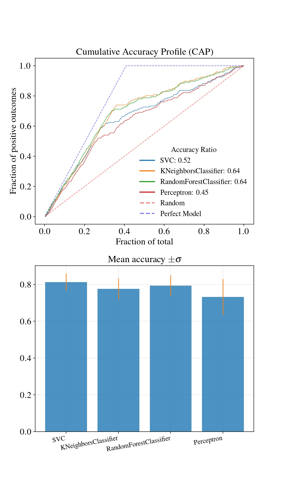

# GSClassification Tool
A multi-parameter, multi-model k-fold grid search. Designed to find the most promissing model for your classification problem.

## Modules

### data_preprocessing.py
A template to import, treat and export data in the correct format. Highly dependent on your goals.

### GSClassification.py
The classification module containing the classification class.

Current compatible classifiers

- SVC
- DecisionTreeClassifier
- KNeighborsClassifier
- LogisticRegression
- GaussianNB
- RandomForestClassifier
- Perceptron
- SGDClassifier 
- XGBClassifier

## Run

### model_evaluation.py
A script which joins data_preprocessing and GSClassification modules, in order to return statistics about each of the evaluated classifiers and their best parameters.

You need to set:

- Classifiers (comment out the ones you do not wish to include)
- Grid search parameters

## Example
This software comes with an example from [Kaggle's introductory competition](https://www.kaggle.com/c/titanic). It will preprocess data, test different parameters for different models (executing k-fold grid searches to avoid overfitting) and return 

- a sorted pandas dataframe with the best accuracies and parameters;
- the cumulative accuracy profile (CAP) along with an image representation of the above metrics.

In order to modify parameters of the grid search, check sklearn's [GridSearchCV guide](https://scikit-learn.org/stable/modules/generated/sklearn.model_selection.GridSearchCV.html).

 </img> 

